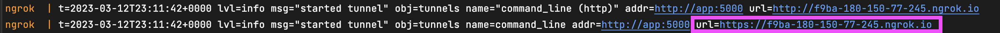

# [WIP] atlassian-connect-sample-app-python

> **_NOTE:_**  This repository is in progress and is not ready yet.

## About
This repository contains a [Flask](https://flask.palletsprojects.com/en/2.2.x/) starter for building an [Atlassian Connect app](https://developer.atlassian.com/cloud/jira/platform/getting-started-with-connect/).
This app is aimed to help you to easily add your integration in Jira.

## Table of Contents
- [Features](#features)
- [Getting started](#getting-started)
- [Running your application](#running-your-application)
- [Testing](#testing)
- [Getting help](#getting-help)
- [License](#license)

## Features
- TBD

## Getting started
### Prequesites
To run the Python sample app you'll need to have to following installed:
- Python 3
- Docker

Once the pre-reqs have been met you simply need to:
- create a .env file and add your `NGROK_AUTHTOKEN`. Create/log into your ngrok account and simply copy your token from the home page (found under 'Connect your account').
- run `docker-compose up`. Once the docker finishes running, you can view the tunneled `NGROK_URL` in the logs.

Now that the sample up is up-and-running, you just need to navigate to your Jira instance (you can create one [here](https://www.atlassian.com/try/cloud/signup?product=confluence.ondemand,jira-software.ondemand,jira-servicedesk.ondemand,jira-core.ondemand&developer=true) if you don't already have one)
and:
- navigate to **Apps** in the navbar > **Manage your apps**
- click **Settings**, check the box next to **Enable development mode** and click **Apply**
- refresh the page
- click **Upload app**, paste in `<NGROK_URL>/atlassian-connect.json`, and click **Upload**

## Running your application
- TBD

## Testing
- TBD

## Getting help
- TBD

## License
The project is available as open source under the terms of the [MIT License](./LICENSE).
